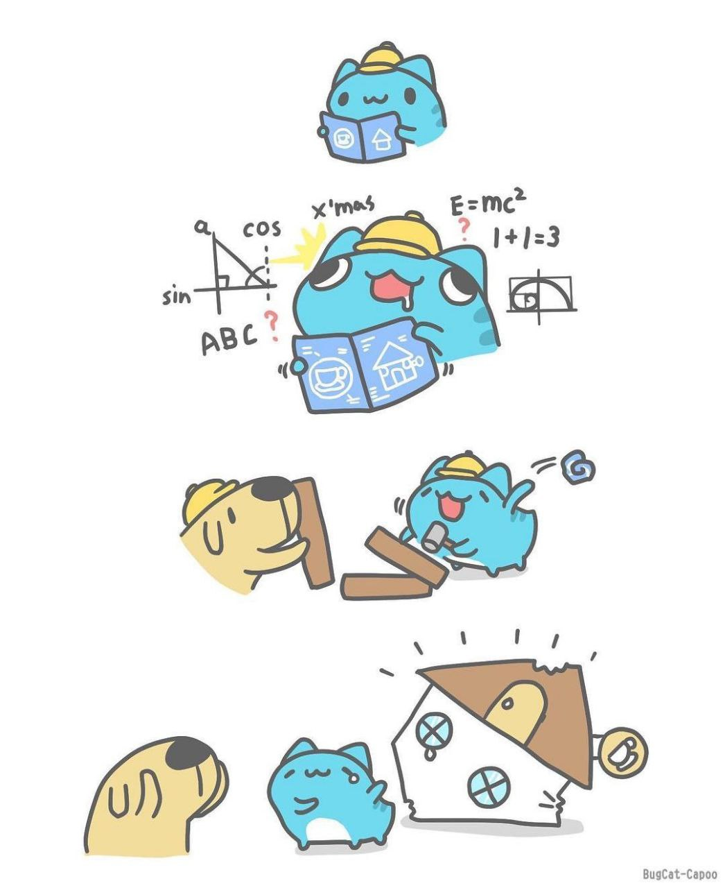

# Запуск докером

docker-compose up --build

# Техническое задание для системы управления учебными программами

## Роли пользователей

### Администраторы

Администраторы отвечают за управление преподавателями и учебными программами, а также статусами учебных программ. Их обязанности включают:

- Добавление и удаление преподавателей.
- Изменение информации о преподавателях.
- Добавление и удаление учебных программ.
- Назначение учебных программ конкретным преподавателям.
- Изменение существующих статусов учебных программ.
- Добавление новых статусов.

### Преподаватели

Преподаватели отвечают за просмотр, изменение, удаление и загрузку доступных им учебных программ. Они также отвечают за создание новых учебных программ.

## Учебные программы

Учебная программа - это объект, который может быть связан с одним или несколькими преподавателями. Каждая учебная программа имеет следующие атрибуты:

- Заглавие.
- Год, с которого программа будет использоваться. Она используется до 5 лет, после чего должна быть переделана (но может быть продлена).
- Специальность (учебная программа может быть составлена для нескольких специальностей - СПИСОК!) (Например, операционные системы (это заглавие) для специальностей (список спец:Web, Pocks, Primat ....))
- Дата истечения срока действия.
- Статус (одно из четырех состояний: "В разработке", "Прошло внутренний нормо-контроль", "Прошло внешний контроль в УМО", "Одобрено для печати").
- Дата последнего изменения.
- Форма обучения.
- Разработчик программы.

## УТОЧНЕНИЕ:

- Статусы - это список, выбирается один статус для одной программы.
- Специальности - это список, выбирается одна или несколько специальностей для одной программы.

## Хранение данных

Учебные программы хранятся в виде документов Word, с использованием BLOB-объектов для хранения файлов. Информация об учебных программах хранится в базе данных.

## Пользовательский интерфейс

На странице преподавателя отображаются все доступные ему учебные программы, а также информация о программе (id, заглавие, год использования, специальность, статус, возможность скачать файл, последняя модификация, имя разработчика, дата истечения программы). Когда срок действия учебной программы приближается к концу, отображается предупреждение.

На странице администратора отображаются все преподаватели и учебные программы. Преподаватели представлены следующими данными: ID, имя, контактная информация, роль.
